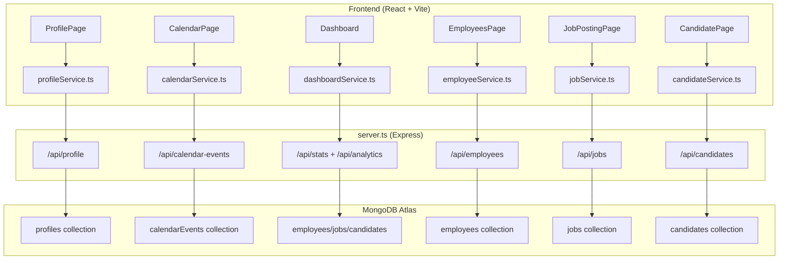

# My Contribution — HireMate HR Dashboard

## Overview of What I Built

I was responsible for building **3 major pieces** of the HireMate system:

1. **Profile Page** — Full user profile management with inline editing
2. **Calendar Page** — Interactive calendar with event scheduling and management
3. **Server.ts (Backend)** — The entire Express + MongoDB backend powering the application

---

## 1. Profile Page (`src/pages/ProfilePage.tsx`)

### What It Does
A professional user profile page where HR admins can view and edit their personal information, all persisted to the database.

### Features I Implemented

| Feature | Description |
|:---|:---|
| **Profile Display** | Shows user avatar, name, role, company, location, join date, and bio with a premium gradient header cover |
| **Inline Editing** | Toggle edit mode via the ✏️ button — all fields become editable input fields without navigating to a separate page |
| **Save / Cancel** | Save sends a `PUT /api/profile` request to the backend; Cancel reverts to previous values |
| **Success Toast** | Animated "Profile saved successfully!" notification using Motion (framer-motion) |
| **Loading State** | Spinner while profile data is being fetched from the backend |
| **Stats Display** | Shows "Active Projects" and "Candidates Hired" metrics in styled stat cards |
| **Sign Out** | Logout button that clears session and returns to login screen |

### How It Works (Data Flow)

```
ProfilePage Component
       │
       ├── On Mount: calls getProfile(email)  →  GET /api/profile?email=...
       │                                              │
       │                                              ▼
       │                                     MongoDB "profiles" collection
       │
       └── On Save:  calls updateProfile(data)  →  PUT /api/profile
                                                       │
                                                       ▼
                                              Updates/inserts in MongoDB
```

### Key Technical Decisions
- **Service Layer Pattern:** Frontend calls `profileService.ts` (not the API directly) — this keeps API logic separated from UI components
- **Editable Fields:** Name, Role, Company, Location, and Bio are all editable inline
- **Avatar Auto-Generation:** Uses `ui-avatars.com` API to generate avatars based on the user's name
- **Robust Error Handling:** Every API call checks response status and content-type before parsing JSON

---

## 2. Calendar Page (`src/pages/CalendarPage.tsx`)

### What It Does
A full interactive HR calendar for scheduling recruitment events like interviews, team syncs, policy reviews, and management meetings — all backed by the database.

### Features I Implemented

| Feature | Description |
|:---|:---|
| **Interactive Calendar Grid** | Full month view with clickable day cells; highlights today and selected day |
| **Month Navigation** | Previous/Next month buttons with `◀ ▶` controls |
| **Day Selection & Filtering** | Click any day → side panel filters events for that specific day only |
| **"Show All" Toggle** | Button to reset filter and see all events for the month |
| **Schedule Event Modal** | Animated popup form to create new events with title, time, category, color, and day |
| **Event Categories** | Candidate, Internal, Management, Policy — each with selectable color labels |
| **Color Labels** | Indigo, Blue, Purple, Emerald — visual indicators on each event |
| **Delete Events** | Hover over an event → 🗑️ trash icon appears → confirms deletion |
| **Real-time Sync** | Auto-polls the backend every 30 seconds for new events |
| **Loading Spinner** | Shows spinner while events are being fetched |
| **Event Counter** | Info card showing total events for the current month |
| **Database Persistence** | All events are stored in MongoDB and survive page refreshes |

### How It Works (Data Flow)

```
CalendarPage Component
       │
       ├── On Mount + every 30s: getCalendarEvents(month, year)
       │                              │
       │                              ▼
       │                    GET /api/calendar-events?month=X&year=Y
       │                              │
       │                              ▼
       │                    MongoDB "calendarEvents" collection
       │
       ├── "Schedule Event" button → Modal form
       │       └── On submit: addCalendarEvent(event)  →  POST /api/calendar-events
       │
       └── Delete (🗑️ icon) → deleteCalendarEvent(id)  →  DELETE /api/calendar-events/:id
```

### Key Technical Decisions
- **Month/Year Query Filtering:** The backend filters events by `month` and `year` fields — only the relevant month's events are fetched, not the entire collection
- **`useCallback` for fetch:** Used React's `useCallback` hook to memoize the fetch function and prevent unnecessary re-renders
- **Event Dots on Calendar:** Days with events show a small indicator dot, so you can see at a glance which days are busy
- **Confirmation on Delete:** Uses `confirm()` dialog to prevent accidental deletions

---

## 3. Server.ts — The Full Backend (`server.ts`)

### What It Does
A **1,297-line TypeScript Express server** that powers the entire HireMate application. It handles all API routes, database connections, and serves the frontend.

### Architecture I Built



### All API Routes I Created

| Method | Endpoint | Purpose |
|:---|:---|:---|
| `GET` | `/api/health` | Server health check |
| `GET` | `/api/debug` | Shows DB connection status, environment info |
| `GET` | `/api/employees` | Fetch all employees |
| `POST` | `/api/employees` | Add new employee |
| `PUT` | `/api/employees/:id` | Update employee |
| `DELETE` | `/api/employees/:id` | Delete employee |
| `GET` | `/api/jobs` | Fetch all job postings (sorted by date) |
| `POST` | `/api/jobs` | Create new job posting |
| `PUT` | `/api/jobs/:id` | Update job posting |
| `DELETE` | `/api/jobs/:id` | Delete job posting |
| `GET` | `/api/candidates` | Fetch candidates (with optional `?jobId=` filter) |
| `POST` | `/api/candidates` | Add candidate (also increments job applicant count) |
| `PUT` | `/api/candidates/:id` | Update candidate status |
| `DELETE` | `/api/candidates/:id` | Delete candidate (also decrements job applicant count) |
| `GET` | `/api/stats` | Dashboard stats (employee/job/candidate counts + growth metrics) |
| `GET` | `/api/analytics` | 6-month recruitment trends data for the chart |
| `GET` | `/api/calendar-events` | Fetch calendar events (filterable by month/year) |
| `POST` | `/api/calendar-events` | Create calendar event |
| `PUT` | `/api/calendar-events/:id` | Update calendar event |
| `DELETE` | `/api/calendar-events/:id` | Delete calendar event |
| `GET` | `/api/profile` | Get user profile (by email) |
| `PUT` | `/api/profile` | Update user profile (upsert pattern) |
| `POST` | `/api/ai/generate-job` | AI-powered job description generation (Gemini) |
| `POST` | `/api/ai/rank-candidates` | AI-powered candidate ranking (Gemini) |
| `POST` | `/api/ai/parse-resume` | AI-powered resume parsing (Gemini) |

### Major Backend Systems I Built

#### A. Resilient Database Connection (`ResilientDb` class)
- Tries to connect to **MongoDB Atlas** first
- If connection fails (SSL, timeout, IP whitelist), automatically falls back to **in-memory mock database**
- Retries the real connection every **15 seconds** in the background
- Every database operation is wrapped in error handling — if a query fails mid-session, it gracefully switches to mock data

#### B. In-Memory Mock Database (`MockDb` + `MockCollection` classes)
- Full mock implementation of MongoDB operations: `find()`, `findOne()`, `insertOne()`, `updateOne()`, `deleteOne()`, `countDocuments()`
- Pre-seeded with sample employees, jobs, candidates, calendar events, and profile data
- Allows the entire app to work even with zero database connectivity

#### C. Auto-Seeding System (`seedDatabaseIfEmpty()`)
- When connecting to a fresh/empty MongoDB database, automatically inserts:
  - 4 sample employees
  - 3 sample job postings
  - 3 sample candidates (linked to the jobs)
  - 4 sample calendar events
  - 1 default admin profile

#### D. Vite Dev Server Integration
- In development mode, the Express server embeds Vite as middleware
- This means **one single `npm run dev` command** starts both the backend API AND the frontend dev server on the same port
- In production, it serves the built static files from the `/dist` folder

#### E. AI Integration (Google Gemini)
- Three AI endpoints using the Gemini API:
  - **Job Description Generator** — Takes a title + keywords and generates a professional description
  - **Candidate Ranker** — Analyzes candidates against job requirements and returns scores + verdicts
  - **Resume Parser** — Extracts structured data (name, email, skills, experience, education) from resume text
- All AI endpoints have **fallback responses** — if Gemini is unavailable, the app still works with default data

#### F. Port Conflict Resolution
- If port 3000 is already in use, the server automatically falls back to port 3001
- This prevents crashes when multiple instances are running

---

## Summary of My Total Contribution

| Area | What I Built |
|:---|:---|
| **Frontend Pages** | ProfilePage (269 lines), CalendarPage (343 lines) |
| **Frontend Services** | profileService.ts (64 lines), calendarService.ts (88 lines) |
| **Full Backend** | server.ts (1,297 lines) — all API routes, database layer, AI integration, mock system |
| **Total Lines Written** | ~2,061 lines of production code |

### Technologies I Used
- **React** with Hooks (`useState`, `useEffect`, `useCallback`)
- **TypeScript** for type safety on both frontend and backend
- **Express.js** for the REST API server
- **MongoDB** (native driver, not Mongoose) for database operations
- **Motion (Framer Motion)** for animations and transitions
- **Google Gemini AI** for intelligent features
- **Tailwind CSS** for styling
- **Lucide React** for icons
- **Vite** for frontend build tooling
